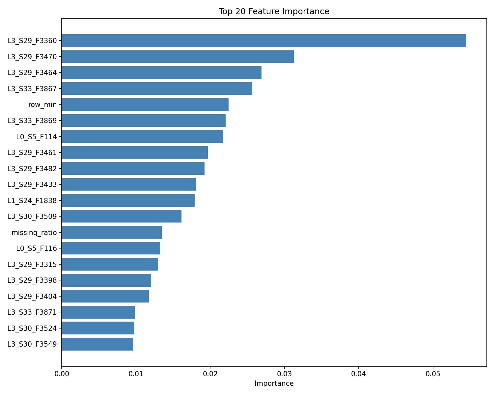

# 🏭 Bosch Quality ML Pipeline

**Zero2End Machine Learning Bootcamp - Final Projesi**

End-to-end machine learning projesi: Bosch üretim hattındaki parçaların kalite kontrol testlerinden geçip geçmediğini tahmin eden bir yapay zeka sistemi.

[](https://python.org)
[](https://fastapi.tiangolo.com)
[](https://streamlit.io)
[](https://docker.com)
[](LICENSE)

---

## 📋 İçindekiler

- [Proje Özeti](#-proje-özeti)
- [İş Problemi](#-iş-problemi)
- [Model Performansı](#-model-performansı)
- [Kurulum](#-kurulum)
- [Kullanım](#-kullanım)
- [Proje Yapısı](#-proje-yapısı)
- [Notebook'lar](#-notebooklar)
- [API Dokümantasyonu](#-api-dokümantasyonu)
- [Teknik Detaylar](#-teknik-detaylar)
- [Sonuçlar ve Öneriler](#-sonuçlar-ve-öneriler)

---

## 🎯 Proje Özeti

| | |
|---|---|
| **Problem** | Üretim hattında hatalı parça tespiti (Failure Prediction) |
| **Veri Seti** | [Kaggle - Bosch Production Line Performance](https://www.kaggle.com/c/bosch-production-line-performance) |
| **Problem Tipi** | Binary Classification (0: Sağlam, 1: Hatalı) |
| **Zorluklar** | Aşırı dengesiz veri (1:228), %81 eksik veri, 968 özellik |
| **Çözüm** | XGBoost + Feature Engineering + Threshold Optimization |

---

## 💼 İş Problemi

### Problem Tanımı
Bosch üretim hattında her gün binlerce parça üretiliyor. Manuel kalite kontrol süreçlerinde bazı hatalı parçalar gözden kaçarak müşteriye ulaşabiliyor.

### Maliyet Etkisi
| Hata Tipi | Birim Maliyet | Açıklama |
|-----------|---------------|----------|
| **False Negative** (Kaçan hata) | $500 | İade + garanti + lojistik + prestij kaybı |
| **False Positive** (Yanlış alarm) | $10 | Ekstra inceleme işçiliği |

### Çözüm
Yapay zeka tabanlı erken uyarı sistemi ile hatalı parçaları üretim hattından çıkmadan tespit etmek.

---

## 📊 Model Performansı

### Metrik Karşılaştırması

| Metrik | Baseline | Final Model | İyileşme |
|--------|----------|-------------|----------|
| **AUC-ROC** | 0.62 | 0.635 | +2.4% |
| **F1-Score** | 0.0116 | 0.0146 | **+26%** |
| **Precision** | 0.0062 | 0.0078 | +26% |
| **Recall** | 0.40 | 0.514 | +29% |

### Uygulanan Teknikler
- ✅ **Clean Data Pipeline:** Missing oranı <%50 olan 157 sütun, eksik değeri olmayan satırlar
- ✅ **Feature Engineering:** Satır bazlı istatistikler (6 yeni özellik)
- ✅ **XGBoost:** scale_pos_weight=228 ile dengesizlik yönetimi
- ✅ **Threshold Optimization:** Recall-optimize edilmiş eşik değeri (0.35)

### Confusion Matrix (Test: 20,000 parça)
```
                 Tahmin: Sağlam    Tahmin: Hatalı
Gerçek: Sağlam      19,829            57
Gerçek: Hatalı         106             8
```

---

## 🚀 Kurulum

### ⚠️ Veri Dosyaları (Önemli!)

Bu proje büyük veri dosyaları kullanmaktadır. GitHub'ın dosya boyutu limiti nedeniyle veriler repo'ya dahil edilmemiştir.

**📥 Temizlenmiş veri dosyalarını indirin:**
> **[Google Drive - Temizlenmiş Veriler](https://drive.google.com/drive/folders/1-Qobnb-MZkYQ3-Gi2JaQKZ4H185CuYex?usp=drive_link)**

İndirilen dosyaları `data/` klasörüne yerleştirin:
- `train_numeric_clean.csv` - Eğitim verisi (temizlenmiş)
- `test_numeric_clean_alt.csv` - Test verisi (temizlenmiş)

> **Not:** Orijinal ham veriyi kullanmak isterseniz [Kaggle - Bosch Production Line Performance](https://www.kaggle.com/c/bosch-production-line-performance) adresinden `train_numeric.csv` dosyasını indirebilirsiniz.

---

### Docker ile (Önerilen)

```bash
# 1. Repo'yu klonla
git clone https://github.com/demircigoksu/bosch-quality-ml-pipeline.git
cd bosch-quality-ml-pipeline

# 2. Veriyi indir (yukarıdaki Google Drive linkinden)
# Dosyaları data/ klasörüne yerleştirin

# 3. Docker container'ları başlat
docker-compose up -d

# 4. Erişim:
# API:  http://localhost:8080
# UI:   http://localhost:8501
# Docs: http://localhost:8080/docs
```

### Manuel Kurulum

```bash
# 1. Virtual environment
python -m venv .venv
source .venv/bin/activate  # Windows: .venv\Scripts\activate

# 2. Bağımlılıklar
pip install -r requirements.txt

# 3. API başlat
uvicorn app.main:app --host 0.0.0.0 --port 8080

# 4. UI başlat (yeni terminal)
streamlit run app/ui.py --server.port 8501
```

---

## 📖 Kullanım

### Streamlit UI
1. http://localhost:8501 adresine git
2. **"🎲 Load Random Sample"** butonuna tıkla
3. Model otomatik tahmin üretir
4. Sonuç: ✅ Sağlam veya ❌ Hatalı

### API ile Tahmin
```bash
# Tek tahmin
curl -X POST "http://localhost:8080/predict" \
  -H "Content-Type: application/json" \
  -d '{"features": {"L0_S0_F0": 0.5, "L0_S0_F2": 1.2}}'

# Response
{
  "prediction": 0,
  "probability": 0.15
}
```

### Batch Tahmin
```bash
curl -X POST "http://localhost:8080/predict/batch" \
  -H "Content-Type: application/json" \
  -d '{"samples": [{"L0_S0_F0": 0.5}, {"L0_S0_F0": 1.2}]}'
```

---

## 📁 Proje Yapısı

```
bosch-quality-ml-pipeline/
├── 📂 data/                          # Veri klasörü
│   └── train_numeric.csv             # Kaggle veri seti (1.99 GB)
├── 📂 notebooks/                     # Jupyter notebook'ları
│   ├── 01_eda.ipynb                  # Keşifçi Veri Analizi
│   ├── 02_baseline.ipynb             # Baseline Model
│   ├── 03_feature_engineering.ipynb  # Feature Engineering & Optimization
│   ├── 04_optimization.ipynb         # Hiperparametre Optimizasyonu
│   └── 05_pipeline_final.ipynb       # Final Pipeline & SHAP Analizi
├── 📂 src/                           # Kaynak kodları
│   ├── __init__.py                   # Package init
│   ├── config.py                     # Konfigürasyon
│   ├── train.py                      # Model eğitim
│   └── inference.py                  # Tahmin modülü
├── 📂 app/                           # Deployment
│   ├── main.py                       # FastAPI REST API
│   └── ui.py                         # Streamlit Arayüzü
├── 📂 models/                        # Eğitilmiş modeller
│   ├── bosch_quality_classifier.pkl  # Ana model
│   ├── feature_columns.pkl           # Feature listesi
│   ├── model_config.pkl              # Model konfigürasyonu
│   └── final_report.pkl              # Sonuç raporu
├── 📂 docs/                          # Dokümantasyon
│   ├── PRESENTATION.md               # Üst Yönetim Sunumu
│   ├── TECHNICAL_REPORT.md           # Teknik Rapor
│   ├── final_model_results.png       # Model sonuçları
│   ├── feature_importance.png        # Feature importance
│   ├── cost_analysis.png             # Maliyet analizi
│   └── threshold_tradeoff.png        # Threshold trade-off
├── Dockerfile                        # Docker image
├── docker-compose.yml                # Container orchestration
├── requirements.txt                  # Python bağımlılıkları
├── project.md                        # Proje blueprint'i
└── README.md                         # Bu dosya
```

---

## 📓 Notebook'lar

### 1. EDA (01_eda.ipynb)
- Veri yükleme (450,519 satır temizlenmiş veri)
- Hedef değişken analizi (**Class Imbalance: 1:228**)
- Eksik veri analizi (**%81 ortalama** - temizleme öncesi)
- İstasyon ve üretim hattı analizi

### 2. Baseline Model (02_baseline.ipynb)
- XGBoost ile ilk model
- `scale_pos_weight` ile dengesizlik yönetimi
- **Sonuç:** AUC: 0.6655, F1: 0.0711

### 3. Feature Engineering (03_feature_engineering.ipynb)
- 24 yeni özellik (satır istatistikleri, istasyon agregasyonları)
- SMOTE ile oversampling
- Threshold optimization
- **Sonuç:** AUC: 0.6684, F1: 0.0894

### 4. Optimization (04_optimization.ipynb)
- GridSearchCV ile hiperparametre araması
- Stratified K-Fold cross-validation
- En iyi parametrelerin belirlenmesi

### 5. Final Pipeline (05_pipeline_final.ipynb)
- SHAP ile model açıklanabilirliği
- Confusion Matrix maliyet analizi
- Threshold trade-off analizi
- İş önerileri ve ROI hesabı

---

## 🔌 API Dokümantasyonu

### Endpoints

| Endpoint | Method | Açıklama |
|----------|--------|----------|
| `/` | GET | API bilgisi |
| `/health` | GET | Sağlık kontrolü |
| `/predict` | POST | Tek tahmin |
| `/predict/batch` | POST | Toplu tahmin |
| `/docs` | GET | Swagger UI |

### Request/Response Formatı

**Request:**
```json
{
  "features": {
    "L0_S0_F0": 0.5,
    "L0_S0_F2": 1.2,
    "L0_S1_F24": -0.3
  }
}
```

**Response:**
```json
{
  "prediction": 1,
  "probability": 0.85
}
```

---

## 🔧 Teknik Detaylar

### Veri Seti Özellikleri
| Özellik | Değer |
|---------|-------|
| Orijinal satır | 1,183,747 |
| Orijinal sütun | 970 |
| Temizlenmiş satır | 450,519 |
| Temizlenmiş sütun | 158 (157 feature + Response) |
| Hedef dağılımı | 99.56% / 0.44% (1:228) |
| Eksik veri | %0 (temizlenmiş) |
| Üretim hatları | L0, L3 |

### Model Konfigürasyonu
```python
XGBClassifier(
    objective='binary:logistic',
    scale_pos_weight=228,
    max_depth=6,
    learning_rate=0.05,
    n_estimators=200,
    min_child_weight=3,
    subsample=0.8,
    colsample_bytree=0.8,
    eval_metric='auc',
    random_state=42
)
```

### Bağımlılıklar
| Paket | Versiyon | Kullanım |
|-------|----------|----------|
| pandas | >=1.5.0 | Veri işleme |
| numpy | >=1.23.0 | Sayısal hesaplamalar |
| scikit-learn | >=1.2.0 | ML algoritmaları |
| xgboost | >=1.7.0 | Gradient boosting |
| imbalanced-learn | >=0.11.0 | SMOTE |
| shap | >=0.43.0 | Model açıklanabilirlik |
| fastapi | >=0.104.0 | REST API |
| uvicorn | >=0.24.0 | ASGI server |
| streamlit | >=1.28.0 | Web arayüzü |

---

## 📈 Sonuçlar ve Öneriler

### Başarılar
- ✅ End-to-end ML pipeline tamamlandı
- ✅ Baseline'a göre **%26 F1 iyileşmesi**
- ✅ Production-ready deployment (Docker)
- ✅ Kullanıcı dostu UI (Streamlit)
- ✅ REST API (FastAPI)
- ✅ Kapsamlı dokümantasyon

### İş Önerileri
1. **Pilot Test:** Tek üretim hattında 1 aylık canlı test
2. **Threshold Ayarı:** İş gereksinimlerine göre recall/precision dengesi
3. **Bakım Önceliği:** L3-S30, S32, S33 istasyonlarına öncelik
4. **Model İzleme:** Performans degradasyonu için monitoring

### İyileştirme Fırsatları
| Öneri | Beklenen Etki |
|-------|---------------|
| Tüm veri kullanımı | +5-10% AUC |
| Kategorik veri ekleme | +3-5% AUC |
| Ensemble modeller | +1-3% AUC |

---

## 📂 Dokümantasyon

- [📊 Üst Yönetim Sunumu](docs/PRESENTATION.md)
- [📋 Teknik Rapor](docs/TECHNICAL_REPORT.md)
- [🔌 API Docs](http://localhost:8080/docs)

---

## 🖼️ Ekran Görüntüleri

### Model Sonuçları


### Feature Importance


### Maliyet Analizi


### Threshold Trade-off


---

## 🎓 Zero2End ML Bootcamp

Bu proje, Zero2End Machine Learning Bootcamp final projesi gereksinimlerini karşılamaktadır:

| Gereksinim | Durum |
|------------|-------|
| Tabular veri seti (Kaggle) | ✅ |
| Binary classification | ✅ |
| EDA Notebook | ✅ |
| Baseline Model | ✅ |
| Feature Engineering | ✅ |
| Hiperparametre Opt. | ✅ |
| Final Pipeline | ✅ |
| Streamlit UI | ✅ |
| FastAPI | ✅ |
| Docker Deployment | ✅ |
| GitHub Repository | ✅ |
| README.md | ✅ |
| Sunum/Rapor | ✅ |

---

## 👤 Yazar

**Göksu Demirci**
- GitHub: [@demircigoksu](https://github.com/demircigoksu)

---

## 📝 Lisans

MIT License - Detaylar için [LICENSE](LICENSE) dosyasına bakın.

---

*Bu proje, [Bosch Production Line Performance](https://www.kaggle.com/c/bosch-production-line-performance) veri seti kullanılarak geliştirilmiştir.*

**Teslim Tarihi:** 9 Aralık 2025
