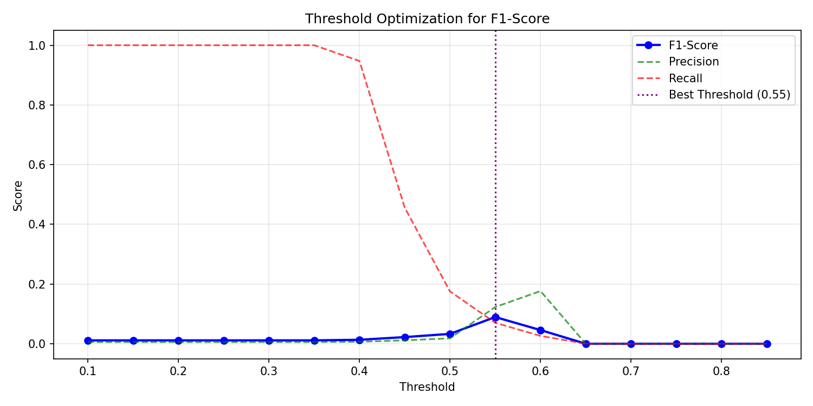

# 🏭 Bosch Quality ML Pipeline

**Zero2End Machine Learning Bootcamp - Final Projesi**

End-to-end machine learning projesi: Bosch üretim hattındaki parçaların kalite kontrol testlerinden geçip geçmediğini tahmin eden bir sistem.

## 🎯 Proje Özeti

| | |
|---|---|
| **Problem** | Üretim hattında hatalı parça tespiti (Failure Prediction) |
| **Veri Seti** | [Kaggle - Bosch Production Line Performance](https://www.kaggle.com/c/bosch-production-line-performance) |
| **Problem Tipi** | Binary Classification (0: Sağlam, 1: Hatalı) |
| **Zorluklar** | Aşırı dengesiz veri (1:175), %81 eksik veri, 968 özellik |

## 📊 Model Performansı

| Metrik | Baseline | Final Model | İyileşme |
|--------|----------|-------------|----------|
| **AUC-ROC** | 0.6655 | 0.6684 | +0.4% |
| **F1-Score** | 0.0711 | 0.0894 | **+25.7%** |
| **Precision** | 0.0411 | 0.1231 | +199.5% |
| **Recall** | 0.2632 | 0.0702 | - |

### 🔧 Uygulanan Teknikler:
- **Feature Engineering:** İstasyon bazlı istatistikler, eksik veri pattern'leri (24 yeni özellik)
- **SMOTE:** Dengesiz veriyi 1:175 → 1:3 oranına getirme
- **XGBoost:** Early stopping ile 300 ağaç
- **Threshold Optimization:** F1 için optimal eşik değeri (0.55)

## 📈 Veri Seti Özellikleri

- **Boyut:** 1.2M satır × 970 sütun (Sample: 100K satır)
- **Hedef Dağılımı:** %99.43 Sağlam, %0.57 Hatalı
- **Eksik Veri:** Ortalama %81
- **Üretim Hatları:** L0, L1, L2, L3 (4 ana hat, ~50 istasyon)

## 🏗️ Proje Yapısı

```
bosch-quality-ml-pipeline/
├── data/                          # Veri klasörü (train_numeric.csv)
├── notebooks/                     # Jupyter notebook'ları
│   ├── 01_eda.ipynb              # Keşifçi Veri Analizi
│   ├── 02_baseline.ipynb         # Baseline Model (XGBoost)
│   ├── 03_feature_engineering.ipynb  # Feature Engineering & Optimization
│   └── 03_pipeline.ipynb         # ML Pipeline
├── src/                           # Kaynak kodları
│   ├── config.py                 # Konfigürasyon parametreleri
│   ├── train.py                  # Model eğitim scripti
│   └── inference.py              # Tahmin modülü
├── app/                           # Deployment
│   ├── main.py                   # FastAPI REST API
│   └── ui.py                     # Streamlit Arayüzü
├── models/                        # Eğitilmiş modeller (.pkl)
├── docs/                          # Görseller ve dokümantasyon
├── Dockerfile                     # Docker image tanımı
├── docker-compose.yml            # Container orchestration
└── requirements.txt              # Python bağımlılıkları
```

## 🚀 Kurulum ve Çalıştırma

### Docker ile (Önerilen)

```bash
# Repo'yu klonla
git clone https://github.com/demircigoksu/bosch-quality-ml-pipeline.git
cd bosch-quality-ml-pipeline

# Docker container'ları başlat
docker-compose up -d

# Erişim:
# API: http://localhost:8080
# UI:  http://localhost:8501
```

### Manuel Kurulum

```bash
# Virtual environment oluştur
python -m venv .venv
source .venv/bin/activate  # Windows: .venv\Scripts\activate

# Bağımlılıkları yükle
pip install -r requirements.txt

# Veriyi data/ klasörüne koy
# Kaggle'dan train_numeric.csv indir

# API başlat
uvicorn app.main:app --host 0.0.0.0 --port 8080

# UI başlat (yeni terminal)
streamlit run app/ui.py
```

## 📓 Notebook'lar

### 1. EDA (01_eda.ipynb)
- Veri yükleme ve örnekleme (100K satır)
- Hedef değişken analizi (Class Imbalance: 1:175)
- Eksik veri analizi (%81 ortalama)
- İstasyon ve üretim hattı analizi

### 2. Baseline Model (02_baseline.ipynb)
- XGBoost ile ilk model
- scale_pos_weight ile dengesizlik yönetimi
- AUC-ROC: 0.6655, F1: 0.0711

### 3. Feature Engineering (03_feature_engineering.ipynb)
- 24 yeni özellik (satır istatistikleri, istasyon bazlı agregasyonlar)
- SMOTE ile oversampling
- Threshold optimization
- Final: AUC-ROC: 0.6684, F1: 0.0894

## 🔌 API Endpoints

| Endpoint | Method | Açıklama |
|----------|--------|----------|
| `/health` | GET | Sağlık kontrolü |
| `/predict` | POST | Tek tahmin |
| `/predict/batch` | POST | Toplu tahmin |
| `/docs` | GET | Swagger dokümantasyonu |

## 🖼️ Ekran Görüntüleri

### Model Sonuçları


### Feature Importance


### Threshold Optimization


## 📦 Bağımlılıklar

- **pandas** - Veri işleme
- **numpy** - Sayısal hesaplamalar
- **scikit-learn** - ML algoritmaları
- **xgboost** - Gradient boosting
- **imbalanced-learn** - SMOTE
- **fastapi** - REST API
- **uvicorn** - ASGI server
- **streamlit** - Web arayüzü
- **matplotlib/seaborn** - Görselleştirme

## 🎓 Zero2End ML Bootcamp

Bu proje, Zero2End Machine Learning Bootcamp final projesi gereksinimlerini karşılamaktadır:
- ✅ Tabular veri seti (Kaggle)
- ✅ Binary classification problemi
- ✅ EDA + Feature Engineering + Model Pipeline
- ✅ Deployment (API + UI + Docker)
- ✅ GitHub repository

## 👤 Yazar

**Göksu Demirci**
- GitHub: [@demircigoksu](https://github.com/demircigoksu)

## 📝 Lisans

MIT License

---

*Bu proje, Bosch Production Line Performance veri seti kullanılarak geliştirilmiştir.*
